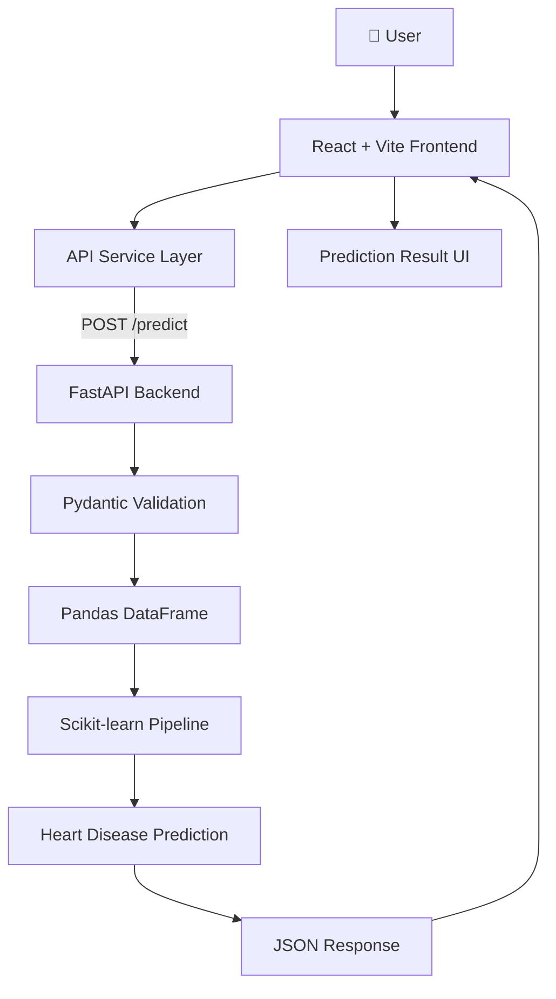
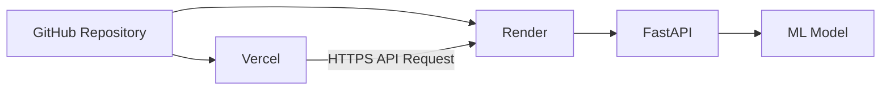

# ❤️ Heart Disease Prediction

An end-to-end Machine Learning web application designed to predict the likelihood of heart disease based on 13 clinical features. This project demonstrates how to integrate a Scikit-learn predictive model into a modern web stack using FastAPI and React.

---

## 🔗 Live Demo

* **Frontend Application (Vercel):** [https://heart-disease-prediction-bice-nu.vercel.app/](https://heart-disease-prediction-bice-nu.vercel.app/?utm_source=gemini)
* **Backend API (Render):** [https://heart-disease-prediction-api-k9yn.onrender.com](https://heart-disease-prediction-api-k9yn.onrender.com?utm_source=gemini)
* **API Documentation (Swagger/OpenAPI):** [https://heart-disease-prediction-api-k9yn.onrender.com/docs](https://heart-disease-prediction-api-k9yn.onrender.com/docs?utm_source=gemini)

---

## 👁️ Project Preview

When interacting with the application, the user experiences a streamlined flow:

1. **Clinical Input Form:** The user is presented with a clean, Tailwind CSS-styled form to input 13 clinical parameters.
2. **Prediction Request:** Upon submission, the frontend sanitizes the inputs and sends a secure HTTP POST request to the backend.
3. **Prediction Response:** The FastAPI backend validates the payload, passes it through the trained ML pipeline, and returns a JSON response containing the prediction.
4. **Result UI:** The React frontend parses the response and displays the predicted category cleanly to the user.

---

## 🎯 Problem Statement

Deploying machine learning models often requires bridging the gap between data science environments (Python/Pandas/Scikit-learn) and full-stack web engineering (REST APIs, React, CORS, cloud hosting).

This application is designed to demonstrate a robust, production-ready implementation of that bridge. It showcases end-to-end model deployment, strict input validation using Pydantic, decoupled frontend/backend architecture, and cloud deployment.

*(Note: This is purely a technical demonstration and is not a medical diagnostic tool.)*

---

## 🏗️ Architecture Overview

### Application Architecture



### Deployment Architecture



* **GitHub:** Source code and version control.
* **Vercel:** Hosts the React/Vite frontend globally for fast asset delivery.
* **Render:** Hosts the FastAPI Python backend and the serialized `.pkl` machine learning model.
* **Browser:** Executes the frontend code and calls the Render API directly over HTTPS.

---

## 🔄 Complete Request/Response Flow

1. **Step 1:** User enters 13 clinical values into the frontend web form.
2. **Step 2:** React state collects and manages the form data.
3. **Step 3:** `frontend/src/services/api.js` constructs the payload and sends a `POST /predict` request.
4. **Step 4:** FastAPI receives the JSON payload.
5. **Step 5:** Pydantic rigorously validates the data types and acceptable ranges for all 13 inputs.
6. **Step 6:** The validated values are structured into a one-row Pandas DataFrame with exact column matching.
7. **Step 7:** The saved Scikit-learn `.pkl` model pipeline receives the DataFrame.
8. **Step 8:** `model.predict()` evaluates the input and generates a categorical prediction.
9. **Step 9:** FastAPI wraps the prediction in a JSON response and sends it back to the client.
10. **Step 10:** React reads the `Predicted_category` field and updates the UI to display the result.

---

## 📊 Sample Input DataFrame

To successfully generate a prediction, the model expects a single-row Pandas DataFrame with the exact following 13 columns. *(Note: This data is for technical illustration only.)*

| age | sex | cp | trestbps | chol | fbs | restecg | thalach | exang | oldpeak | slope | ca | thal |
| --- | --- | --- | --- | --- | --- | --- | --- | --- | --- | --- | --- | --- |
| 29 | 1 | 3 | 120 | 200 | 0 | 0 | 150 | 0 | 1.2 | 1 | 0 | 2 |

### Equivalent JSON Request Payload

```json
{
  "age": 29,
  "sex": 1,
  "cp": 3,
  "trestbps": 120,
  "chol": 200,
  "fbs": 0,
  "restecg": 0,
  "thalach": 150,
  "exang": 0,
  "oldpeak": 1.2,
  "slope": 1,
  "ca": 0,
  "thal": 2
}

```

---

## 📚 API Documentation

### `GET /`

* **Purpose:** Health check and welcome endpoint. Used by deployment services to verify backend uptime.

### `POST /predict`

* **Purpose:** Generate a heart disease prediction based on patient feature data.
* **Request Body:** JSON object matching the 13 features listed above.
* **Response Format:**

```json
{
  "Predicted_category": 0
}

```

*(The integer represents the model's output category where 0 or 1 indicates the predicted presence or absence of heart disease based purely on the mathematical patterns found in the training data).*

---

## 🧑‍💻 API Test Example (cURL)

You can test the live API directly from your terminal:

```bash
curl -X POST \
  "https://heart-disease-prediction-api-k9yn.onrender.com/predict" \
  -H "Content-Type: application/json" \
  -d '{
    "age": 29,
    "sex": 1,
    "cp": 3,
    "trestbps": 120,
    "chol": 200,
    "fbs": 0,
    "restecg": 0,
    "thalach": 150,
    "exang": 0,
    "oldpeak": 1.2,
    "slope": 1,
    "ca": 0,
    "thal": 2
  }'

```

---

## 📖 Feature Dictionary

All features are strictly validated by the backend Pydantic schema to ensure data integrity before inference.

| Feature | Meaning | Type | Valid Range |
| --- | --- | --- | --- |
| `age` | Age | int | 29–77 |
| `sex` | Sex encoding | int | 0–1 |
| `cp` | Chest pain type | int | 0–3 |
| `trestbps` | Resting blood pressure | int | >94 and <200 |
| `chol` | Serum cholesterol | int | 126–564 |
| `fbs` | Fasting blood sugar indicator | int | 0–1 |
| `restecg` | Resting ECG result | int | 0–2 |
| `thalach` | Maximum heart rate | int | 71–202 |
| `exang` | Exercise-induced angina | int | 0–1 |
| `oldpeak` | ST depression | float | 0.0–6.20 |
| `slope` | ST segment slope | int | 0–2 |
| `ca` | Major vessels | int | 0–4 |
| `thal` | Thalassemia encoding | int | 0–3 |

---

## 🧠 Machine Learning Pipeline

The prediction flow encapsulates several technical layers:
`Input` → `Validation (Pydantic)` → `Conversion (Pandas DataFrame)` → `Preprocessing/Model Pipeline` → `model.predict()` → `Prediction output`

The saved `.pkl` object encapsulates the entire model pipeline. All necessary feature scaling, encoding, or transformations required by the original Scikit-learn estimator are embedded within this file, ensuring that raw incoming API data is processed exactly as it was during model training.

---

## 🛠️ Tech Stack

| Domain | Technologies |
| --- | --- |
| **Frontend** | React, Vite, Tailwind CSS, JavaScript |
| **Backend** | Python, FastAPI, Pydantic, Pandas |
| **Machine Learning** | Scikit-learn, Joblib, Saved `.pkl` model pipeline |
| **Deployment** | GitHub, Vercel, Render |
| **API Architecture** | REST, JSON, Swagger/OpenAPI |

---

## 📁 Project Structure

```text
Heart_Disease_Prediction/
├── frontend/
│   ├── src/
│   │   ├── services/
│   │   │   └── api.js
│   │   └── ...
│   ├── package.json
│   └── ...
├── backend/
│   ├── main.py
│   ├── heart_disease_model.pkl
│   └── requirements.txt
└── README.md

```

---

## 🚀 Deployment Process & Learnings

The application is deployed across Vercel (Frontend) and Render (Backend).

**Deployment Steps:**

1. Push the complete project to GitHub.
2. Import the frontend repository into Vercel.
3. Set the frontend root directory to `frontend/`.
4. Deploy the frontend leveraging Vite build tools.
5. Create a Render Web Service for the backend, setting the root directory appropriately.
6. Configure Python build and execution commands based on the backend structure.
7. Deploy the FastAPI service.
8. Verify the `GET /` and `GET /docs` endpoints are live.
9. Verify `POST /predict` accepts payloads.
10. Configure the frontend API URL to point to the live Render backend.
11. Configure CORS in FastAPI to accept traffic from the Vercel production domain.
12. Push fixes to the `main` branch to trigger CI/CD builds on Vercel and Render.
13. Test the complete UI → API → Model flow.

**Real-world Deployment Challenges Solved:**

* **Dependency Issues:** Initially, `pygame` caused a Render build failure due to missing SDL development dependencies in the cloud environment. It was cleanly removed from `requirements.txt`.
* **Version Mismatches:** A Scikit-learn version mismatch caused model loading failures. The environment was synced to ensure identical versions between training and deployment.
* **Path Resolution:** The backend model loading path was hardened using Python's `pathlib` (`BASE_DIR = Path(__file__).resolve().parent`) to prevent arbitrary OS path resolution errors in the cloud.
* **Network & Security:** Strict production CORS rules were established to connect the decoupled Vercel UI with the Render API, mapping `api.js` directly to the production endpoint.

---

## ⚙️ Environment / Configuration

* **Frontend API Config:** The base URL for the backend is configured in `frontend/src/services/api.js`.
* **Backend URL:** `[https://heart-disease-prediction-api-k9yn.onrender.com](https://heart-disease-prediction-api-k9yn.onrender.com)`
* **CORS:** FastAPI is explicitly configured to whitelist the production Vercel domain, ensuring browsers do not block the cross-origin HTTP requests.

---

## 💻 Local Development

To run this project locally, you will need two terminal windows.

**1. Backend Setup:**

```bash
cd backend
python -m venv venv
source venv/bin/activate  # On Windows use `venv\Scripts\activate`
pip install -r requirements.txt
uvicorn main:app --reload

```

**2. Frontend Setup:**

```bash
cd frontend
npm install
npm run dev

```

---

## 🧪 Testing

You can manually verify system integrity through the following:

* **`GET /`**: Open the backend URL in a browser; it should return a healthy status message.
* **`GET /docs`**: Open the Swagger UI and test requests directly via the interactive interface.
* **`POST /predict`**: Use tools like Postman, Insomnia, or cURL to send dummy JSON payloads and verify you receive a 200 OK with `Predicted_category`.
* **Frontend UI**: Fill out the form in the local or live web app, submit, and confirm the UI updates with the prediction result without throwing console errors.

---

## ⚠️ Error Handling

The application gracefully handles multiple failure states in `api.js`:

* **Network Failures:** Caught and presented cleanly if the backend is waking up from a cold start or is unreachable.
* **422 Validation Errors:** If invalid data is sent (e.g., an age of 200), FastAPI's Pydantic schemas catch it and return a 422 Unprocessable Entity, handled by the UI.
* **500 Server Errors:** Server-side crashes are caught and surfaced safely.
* **Unexpected Responses:** Checks for missing `Predicted_category` fields in the payload.

---

## 🛡️ Security / Production Notes

* All traffic is routed over secure HTTPS.
* CORS restricts backend API usage strictly to the Vercel production frontend domain.
* Strict Pydantic input validation protects the ML pipeline from garbage data or injection.
* **Privacy:** Do not enter real sensitive patient data. This application does not store information, but it is hosted on public cloud infrastructure.

---

## ⚕️ Medical Disclaimer

> **This project is for educational and demonstration purposes only. It is not clinically validated or certified as a medical device and must not be used for diagnosis, treatment, or real-world medical decision-making.**

---

## 🔮 Future Improvements

While the core functionality is complete, future iterations could include:

* Implementing automated unit and integration tests.
* Full CI/CD pipeline integration.
* Moving the hardcoded API URL to secure Environment Variables (`.env`).
* Adding stronger API versioning schemes (e.g., `/api/v1/predict`).
* Model monitoring and performance drift tracking over time.
* Adding explainability tools (like SHAP values) to interpret model decisions.
* Displaying model confidence/probability percentages alongside categorical outputs (if supported by the pipeline).
* Integrating backend observability and robust logging.
* Improving overall accessibility (a11y) on the frontend UI.
* Creating a Dockerfile for unified containerized deployment.
* Automated model lifecycle management and version tracking.

---

## 👤 Author

**GitHub:** [https://github.com/codeswith-pawan](https://github.com/codeswith-pawan?utm_source=gemini)

*Built with Python, FastAPI, React, Vite, Tailwind CSS and Scikit-learn.*
